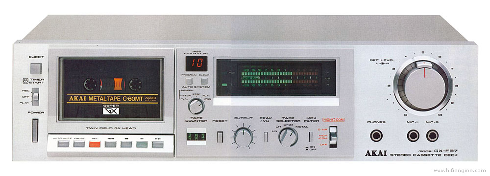

# arduino-pc-remote-control

This application is created specially for remote control RAS13.
However theoretically it supports any other remote controls because all buttons and mappings
are configurable.

## [Firmware](./firmware)

Arduino firmware which receives signals from an IR receiver, converts them into human-readable
strings and writes them to serial port.

Two versions available:

- PC-only control
- PC and Akai GX-F37 cassette deck control

## [Driver](./driver)

This is a Node.js application which reads serial port and performs actions associated with the
particular button on a remote control.

---

