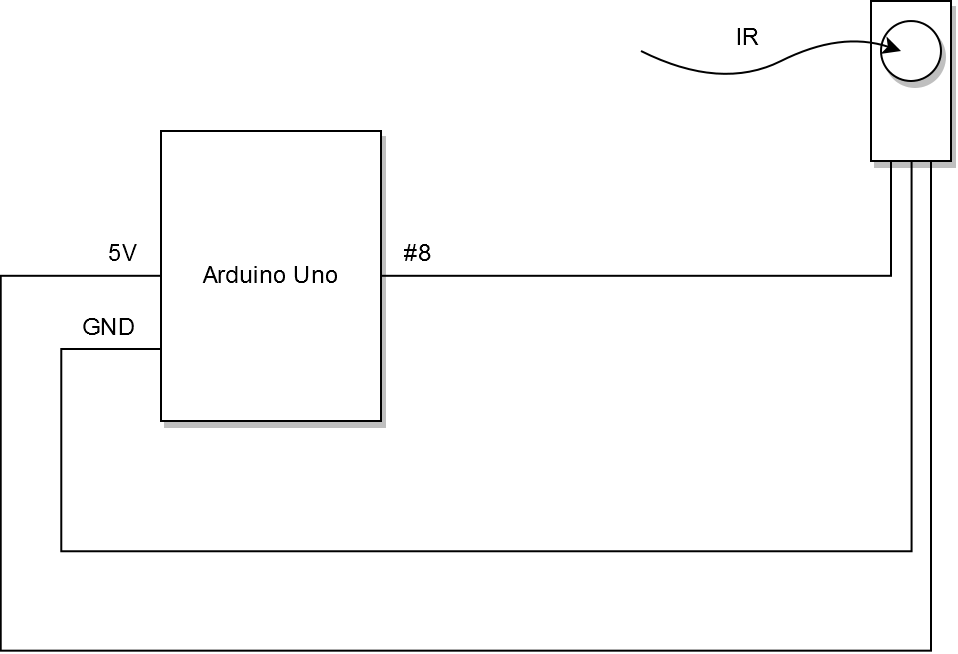

# arduino-pc-remote-control: firmware

Requires [IRremote Arduino Library](http://z3t0.github.io/Arduino-IRremote/).

Inspired by *[How to Set Up an IR Remote and Receiver on an Arduino](http://www.circuitbasics.com/arduino-ir-remote-receiver-tutorial/)*.

## Development

In order to properly compile libraries in sketch files set _Sketchbook location_ (_File > Preferences_) to "firmware" folder path.
